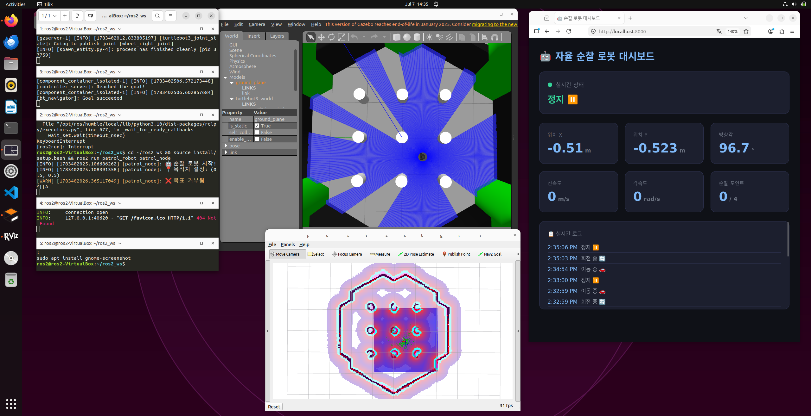

# 🤖 자율 순찰 로봇 시스템

ROS2 + Nav2 + FastAPI를 활용한 자율 순찰 로봇 시뮬레이션 프로젝트

## 📌 프로젝트 개요

Gazebo 시뮬레이터 환경에서 TurtleBot3 로봇이 지정된 경유지를 자율적으로 순찰하며, 동적 장애물을 실시간으로 회피하는 시스템입니다. 웹 대시보드를 통해 로봇의 상태를 실시간으로 모니터링할 수 있습니다.

## 🛠 기술 스택
| 분야 | 기술 |
|------|------|
| 로봇 미들웨어 | ROS2 Humble |
| 시뮬레이터 | Gazebo |
| 자율주행 | Nav2 (SLAM + Navigation) |
| 백엔드 | FastAPI, WebSocket |
| 언어 | Python |
| 환경 | Ubuntu 22.04 |

## ✨ 주요 기능
- SLAM 지도 생성: slam_toolbox로 환경 지도 자동 생성
- 다중 경유지 자율 순찰: 4개 Waypoint를 반복 순찰
- 동적 장애물 회피: 주행 중 장애물 감지 시 실시간 경로 재계획
- 웹 대시보드: FastAPI + WebSocket으로 로봇 상태 실시간 모니터링

## 🚀 실행 방법

### 1. Gazebo 실행
```bash
ros2 launch turtlebot3_gazebo turtlebot3_world.launch.py
```

### 2. Nav2 실행
```bash
ros2 launch turtlebot3_navigation2 navigation2.launch.py use_sim_time:=true map:=$HOME/map.yaml
```

### 3. 순찰 노드 실행
```bash
ros2 run patrol_robot patrol_node
```

### 4. 웹 대시보드 실행
```bash
ros2 run patrol_robot dashboard_server
```
브라우저에서 http://localhost:8000 접속

## 💡 개발 환경
- OS: Ubuntu 22.04 (VirtualBox)
- ROS2: Humble Hawksbill
- Python: 3.10
